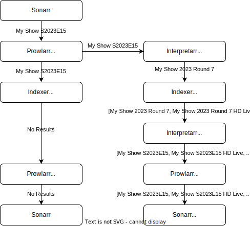

# Interpretarr

Interpretarr is a middleware that sits between Sonarr/Prowlarr and indexer sites to handle non-standard releases from indexers.

## What issue does Interpretarr solve?

- Sonarr requests a release from Prowlarr
- Prowlarr searches indexers for the release
- No results show up because the releases are not named in the S00E00 format that Sonarr expects 

## How does Interpretarr fix this?
- Sonarr requests a release from Prowlarr
- Prowlarr searches one of the custom indexers setup for Interpretarr
- Interpretarr requests the release from the indexer
- Interpretarr parses the search term and reformats it to one that will return better results
- Interpretarr parses the response from the indexer and adds Sonarr appropriate episode and season numbers to the release title
- Prowlarr formats the response and sends it on to Sonarr
- Sonarr accepts the release and queues it on your torrent client
- The download finishes and Sonarr fails to import due to the files not having the corrent name
- Interpretarr renames the download on the torrent client to match the name it sent to Prowlarr
- Sonarr attempts to import the file again and succeeds due to the updated names



## Supported Release Formats
- Formula 1 (2014-Present) 
	- Indexer: 1337x / torrentleech

## Installation
- Download source code
- Extract the release to a folder
- Update .env.template with your environment variables and rename to .env
- Update and copy the .yml files in ProwlarrCustomDefinitions to /Definitions/Custom/ in your Prowlarr install
- Build and run Interpretarr
```
docker build -t interpretarr .
docker run -d --name=interpretarr -p 5000:5000 --env-file .env interpretarr
```
- Configure Prowlarr to use the custom indexers

## TODO
 - [ ] More indexers
 - [ ] Configurable services ie. url, categories, priority, enabled/disabled etc.
 - [ ] Move more logic to Prowlarr/Cardigann definitions, could be a better way of handling url rewrites
 - [ ] Proxy support
 - [ ] Tests
